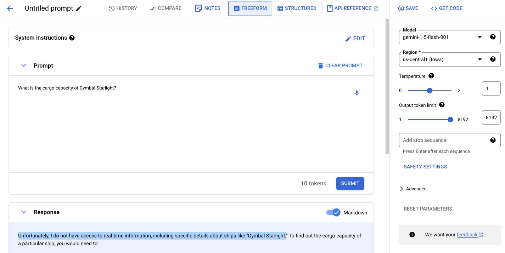
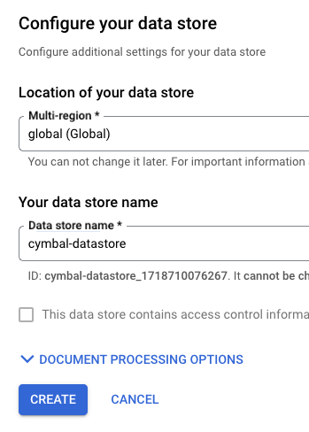
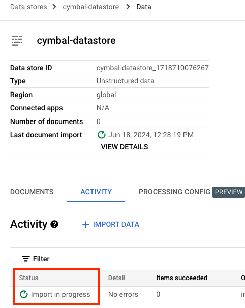
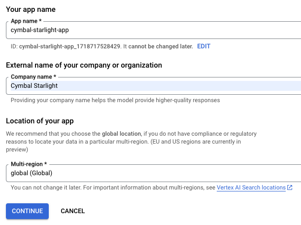
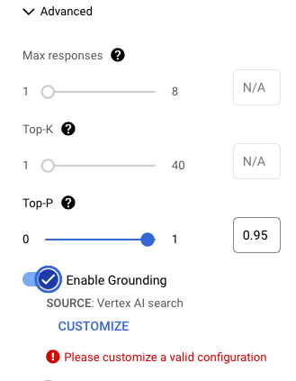
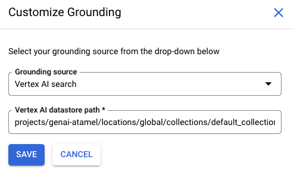

# Grounding with your own data with Vertex AI Search

In this sample, you'll learn how to use Vertex AI Search to ground LLM with your
own private data. More specifically, you'll:

1. Ask the LLM questions about a fictional vehicle, Cymbal Starlight 2024,
   and see that it cannot answer questions.
1. Ground the LLM with a PDF of user manual for Cymbal Starlight 2024 using
   Vertex AI Search.
1. Ask the LLM questions about the vehicle and see that you get answers back.

## Without grounding

First, let's ask a question to the LLM about the vehicle without any
grounding. You can do this in [Vertex AI section of Google Cloud
Console](https://console.cloud.google.com/vertex-ai/generative/language/create/text)
against any model.

Prompt:
> What is the cargo capacity of Cymbal Starlight?

Response:
> Unfortunately, I do not have access to real-time information,
> including specific details about ships like "Cymbal Starlight"
> ...



As you can see, the model thinks we're talking about a ship and cannot really answer the
question.

There's also a [main.py](main.py) sample that you can run **without** grounding:

```sh
python main.py --project_id your-project-id
```

You get a similar response:

```sh
Prompt: What is the cargo capacity of Cymbal Starlight?
Response text: I do not have access to real-time information, including specific details about ships like the "Cymbal Starlight."
```

## Create datastore with PDF

To use a PDF for grounding, you need to upload the PDF to a Cloud Storage
bucket and setup a datastore to import from that bucket.

We'll use the fictitious [cymbal-starlight-2024.pdf](cymbal-starlight-2024.pdf) user manual file.

Create a Cloud Storage bucket with uniform bucket-level access and upload the
PDF file:

```sh
gsutil mb -b on gs://cymbal-starlight-bucket
gsutil cp cymbal-starlight-2024.pdf gs://cymbal-starlight-bucket
```

Go to [Agent Builder](https://console.cloud.google.com/gen-app-builder) section
of the Google Cloud Console. Click on `Data Stores` on the left and `Create
Data Store` button. Select `Cloud Storage`.

Point to the PDF file in the bucket and continue:


Give your datastore a name and click `Create`:



You need to wait until the import is complete which can take up to 10-15 minutes:



## Create a search app

Before you can use grounding, we need to create a search app and point to the
datastore you just created.

Go to [Agent Builder](https://console.cloud.google.com/gen-app-builder) section
of the Google Cloud Console and click on `Create App` button:

1. Select `Search` app type.
1. For Content, select `Generic`.
1. Make sure `Enterprise edition features` is enabled
1. Give your app a name and enter company info.



In the next page, choose the data store you created earlier and click `Create`:


## Setup grounding with Vertex AI Search

> [!CAUTION]
> Make sure the datastore import is complete before you continue.
> If you get an error message: "Cannot use enterprise edition features" or
> something similar, you might need to wait a little before trying again.

Let's setup grounding with Vertex AI Search now.

Go back to [Vertex AI section of Google Cloud
Console](https://console.cloud.google.com/vertex-ai/generative/language/create/text)
and in the `Advanced` section, select `Enable grounding`:



Customize grounding and point to the datastore you just created:



This is the format of the datastore string:

`projects/{}/locations/{}/collections/{}/dataStores/{}`

In my case, it's as follows:

`projects/genai-atamel/locations/global/collections/default_collection/dataStores/cymbal-datastore_1718710076267`

## With grounding

Finally, we're ready to ask questions about the vehicle **with** grounding enabled.

Let's start with the previous question:

Prompt:
> What is the cargo capacity of Cymbal Starlight?

Response:
> The Cymbal Starlight 2024 has a cargo capacity of 13.5 cubic feet.

Let's ask another question:

Prompt:
> What's the emergency roadside assistance phone number?

Response:
> 1-800-555-1212

Also run [main.py](main.py) Python sample **with** grounding:

```sh
python main.py --project_id your-project-id --data_store_path projects/your-project-id/locations/global/collections/default_collection/dataStores/your-datastore-id
```

You get a similar response:

```sh
Prompt: What is the cargo capacity of Cymbal Starlight?
Response text: The Cymbal Starlight 2024 has a cargo capacity of 13.5 cubic feet.
```

Yay, it works!

## References

* [Get started with generic search docs](https://cloud.google.com/generative-ai-app-builder/docs/try-enterprise-search)
* [Grounding decision flowchart](https://cloud.google.com/docs/ai-ml/generative-ai#grounding)
* [Getting Started with Grounding with Gemini in Vertex AI notebook](https://github.com/GoogleCloudPlatform/generative-ai/blob/main/gemini/grounding/intro-grounding-gemini.ipynb)
* [Grounding for Gemini with Vertex AI Search and DIY RAG talk](https://youtu.be/v4s5eU2tfd4)
* [Fix My Car sample app](https://github.com/GoogleCloudPlatform/generative-ai/tree/main/gemini/sample-apps/fixmycar)