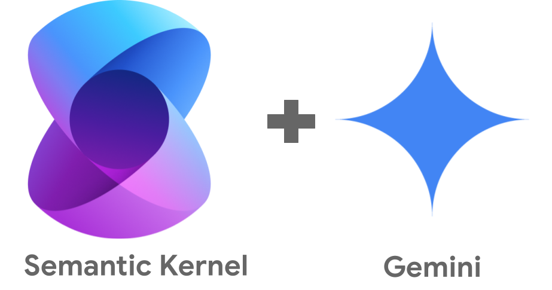

# HelloWorld Semantic Kernel with Gemini on Vertex AI



## Introduction

[Semantic Kernel](https://learn.microsoft.com/en-us/semantic-kernel/overview/)
open-source framework from Microsoft to build AI agents and integrate AI models
into your C#, Python, or Java applications.

In this sample, you'll see how to use Semantic Kernel with Gemini on Vertex AI
in a C# application.

## Get a Google Cloud Project and a Bearer Token

For Vertex AI, you need a Google Cloud project with Vertex AI service enabled.
Once you create the project, make a note of the project id.

You also need a bearer key for authentication. You can get that with `gcloud`:

```sh
gcloud auth print-access-token
```

## Create a C# console application

Create a C# console application:

```sh
dotnet new console -o SemanticKernelGeminiGoogleAi
```

## Install Semantic Kernel and Google connector

Add Semantic Kernel to your console app:

```sh
dotnet add package Microsoft.SemanticKernel
```

You also need the Google connector for Gemini model:

```sh
dotnet add package Microsoft.SemanticKernel.Connectors.Google --prerelease
```

## Build the app

We're now ready to build the app.

First, some imports, choosing the model we want to use and reading the location,
project id, and bearer key from env variables:

```csharp
using Microsoft.SemanticKernel;
using Microsoft.SemanticKernel.ChatCompletion;
using Microsoft.SemanticKernel.Connectors.Google;

public class Program
{
    const string Location = "us-central1";
    const string ModelId = "gemini-1.5-flash";
    static readonly string ProjectId = Environment.GetEnvironmentVariable("PROJECT_ID") ?? throw new ArgumentNullException("PROJECT_ID environment variable is not set.");

    static readonly string BearerKey = Environment.GetEnvironmentVariable("BEARER_KEY") ?? throw new ArgumentNullException("BEARER_KEY environment variable is not set.");
```

Next, create a kernel with Google AI's Gemini chat completion. 

The Google chat completion connector is currently experimental. To use it, you
will need to add #pragma warning disable SKEXP0070:

```csharp
static async Task Main()
{
    // Create a kernel with Google AI's Gemini chat completion
#pragma warning disable SKEXP0070
    var builder = Kernel.CreateBuilder().AddGoogleAIGeminiChatCompletion(ModelId, ApiKey);
```

Build the kernel and initialize some settings for Gemini:

```csharp
// Build the kernel
Kernel kernel = builder.Build();
var chatCompletionService = kernel.GetRequiredService<IChatCompletionService>();

// Settings
GeminiPromptExecutionSettings settings = new()
{
    Temperature = 0.8,
    MaxTokens = 8192
};
```

Create a chat history and use it a loop for a conversation:

```csharp
// Create a history store the conversation
var history = new ChatHistory();

// Initiate a back-and-forth chat
string? userInput;
while (true)
{
    // Collect user input
    Console.Write("User > ");
    userInput = Console.ReadLine();
    if (userInput == null)
    {
        break;
    }

    // Add user input
    history.AddUserMessage(userInput);

    // Get the response from the AI
    var result = await chatCompletionService.GetChatMessageContentAsync(
        history,
        executionSettings: settings,
        kernel: kernel);

    // Print the results
    Console.WriteLine("Assistant > " + result);

    // Add the message from the agent to the chat history
    history.AddMessage(result.Role, result.Content ?? string.Empty);
}
```

You can see the full [Program.cs](./Program.cs).

## Run the app

To run the app, first you need to set your Google Cloud project id and bearer key:

```sh
export PROJECT_ID=your-google-cloud-project-id
export BEARER_KEY=your-bearer-key-for-auth
```

Run the app:

```sh
dotnet run
```

You can have a chat with Gemini now:

```sh
User > Hello
Assistant > Hello! 👋  What can I do for you today? 😊 

User > How are you?
Assistant > I'm doing well, thank you for asking! 😊  As a large language model, I don't have feelings
or experiences like humans do, but I'm always here and ready to assist you with any questions or tasks you might have.

What about you? How are you doing today?
```

## References

* [Getting started with Semantic Kernel](https://learn.microsoft.com/en-us/semantic-kernel/get-started/quick-start-guide?). 
* [Chat completion tutorial - C# and Google Gemini](https://learn.microsoft.com/en-us/semantic-kernel/concepts/ai-services/chat-completion/?tabs=csharp-Google)
